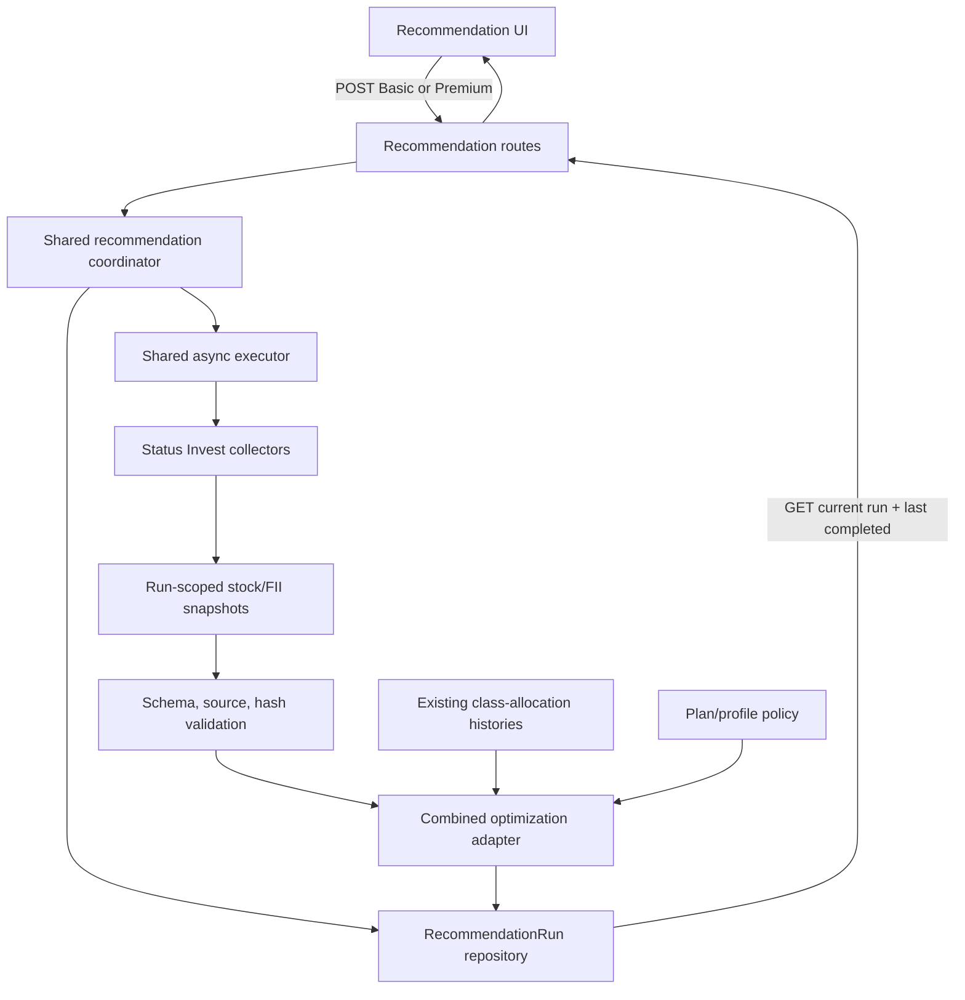

# Status Invest-backed Recommendations Design

**Spec**: `.specs/features/status-invest-backed-recommendations/spec.md`

**Status**: Approved

---

## Architecture Overview

One asynchronous coordinator serves Basic and Premium API routes. It preserves route-specific profile policy and entitlements, but shares run creation, Status Invest refresh, run state, result persistence, and UI polling.



Each new run fetches both Status Invest datasets to its own workspace, validates and hashes them, and passes them to the profile-based `multi_run` selectors. Class weights and historical risk continue to use the existing plan-specific dated market-history inputs and reference sleeves. The result combines class allocations with the selected stock/FII constituents; current Status Invest candidates are not applied retrospectively.

Basic now returns `202` like Premium and uses the same account-scoped run polling. The UI loads the latest run and latest completed run separately. It polls until a terminal state with backoff; polling and page reloads never trigger a refresh.

---

## Code Reuse Analysis

### Existing Components to Leverage

| Component | Location | How to Use |
| --- | --- | --- |
| Run lifecycle, queue persistence, and account-scoped reads | `api/app/services/premium_recommendation.py`, `api/app/services/premium_executor.py`, `api/app/repositories/recommendations.py` | Generalize existing queued/running/completed/failed flow for both plans. |
| Run record and result/provenance storage | `api/app/db/models.py:69-99` | Reuse `RecommendationRun`, `result_json`, `provenance_json`, output hash, timestamps, and failure fields; avoid migration unless implementation proves a field is missing. |
| Per-run workspace | `api/app/services/premium_executor.py:75-121` | Store stock/FII source files under `workspace_root / run_id`; never write to shared canonical CSV paths. |
| Status Invest collectors | `py/fetch_status_invest.py:156-193,175-184`; `py/fetch_status_invest_fii.py:195-243,221-230` | Call `refresh(output_path=..., timeout=...)` with unique per-run paths. Existing collectors atomically write their requested destination. |
| Snapshot manifest | `py/snapshot_manifest.py:105-153,167-250,327-417` | Reuse provider, path, metadata, and SHA-256 structures where applicable; keep market-history and selector source roles explicit. |
| Profile-based selector configuration | `api/app/services/premium_policy.py:202-253,298-442` | Reuse Premium policy generation from suitability score, dimensions, and restrictions; preserve max-quality/adaptive bounds; add the minimal Basic generic-profile mapping into the same explicit selector contract. |
| Stock/FII selector | `py/pipelines/multi_run.py:917-1008,1180-1205`; `api/app/adapters/premium_optimization.py:526-590` | Reuse the existing `multi_run` engine and explicit per-run input paths. |
| Class-allocation engines | `api/app/adapters/allocation_engine.py:165-216`; `api/app/adapters/premium_optimization.py:497-518` | Preserve the existing allocation histories and plan-specific allocation policy. |
| Recommendation status/read API | `api/app/routers/recommendations.py:25-60,149-161` | Use account-scoped run polling and add `GET /v1/recommendations/latest-completed` scoped to account/profile/plan. Register static route before `/{recommendation_id}`. |
| Recommendation UI and API types | `web/components/recommendation/recommendation-view.tsx`; `web/lib/api-client.ts:98-127`; `web/lib/api-types.ts:48-95` | Add explicit “new recommendation” action and render constituents/provenance for both plans. |

### Integration Points

| System | Integration Method |
| --- | --- |
| Basic recommendation route | Replace synchronous class-only execution with queued run creation and dispatch through the shared coordinator. |
| Premium recommendation route | Keep its existing run lifecycle and policy resolution; dispatch through the generalized coordinator. |
| Last completed result | Add account/profile/plan-filtered `GET /v1/recommendations/latest-completed`; define static route before `GET /{recommendation_id}`. |
| Status Invest | Use existing stock/FII `refresh(output_path=...)` functions; each run supplies unique paths. |
| Class market data | Keep current Basic and Premium allocation inputs separate from selector files. Do not infer return history from Status Invest fundamentals. |
| Database | Generalize queued-run creation to store `plan=basic` or `plan=premium`; persist selector result and source provenance in existing result/provenance JSON fields. |
| Web app | Use common run status polling for both plans. Show stored results on page load; start refresh only from a new-run action. |

---

## Components

### Recommendation coordinator

- **Purpose**: Create account-scoped runs and dispatch Basic/Premium requests into one asynchronous lifecycle.
- **Location**: `api/app/services/premium_recommendation.py` (generalize in place to avoid a parallel run service).
- **Interfaces**:
  - `create_run(account_id, profile_id, plan, force) -> RecommendationRun` - validate profile/plan, resolve policy, persist queued state, dispatch worker.
  - `get_latest_completed(account_id, profile_id, plan) -> RecommendationRun | None` - load only the last successful result for the current account/profile/plan.
- **Dependencies**: Existing profile services, recommendation repository, executor, allocation inputs.
- **Reuses**: Premium run creation, active-run reuse, plan gating, manifest capture, and run state transitions.

An active queued/running run for the same account, profile, and plan is reused. Premium keeps existing `force=false` cached-result behavior for compatibility; the explicit “new recommendation” action sends `force=true`. Basic's explicit new-run POST creates a run. Every actual new run refreshes both Status Invest sources.

### Shared recommendation executor

- **Purpose**: Refresh per-run inputs, execute selection plus allocation, and persist success/failure.
- **Location**: `api/app/services/premium_executor.py` (generalize behavior for both plans).
- **Interfaces**:
  - `execute_run(run_id) -> None` - transition queued → running → completed/failed.
- **Dependencies**: Run repository, Status Invest collectors, combined optimization adapter.
- **Reuses**: Single-worker executor, run-specific workspace, existing failure handling, sanitized failure reason.

### Run-scoped Status Invest inputs

- **Purpose**: Produce validated, immutable stock/FII source files with reproducible provenance for one run.
- **Location**: New helper in `api/app/services/` or `api/app/adapters/` (exact placement follows existing dependency direction).
- **Interfaces**:
  - `refresh_inputs(run_id, workspace) -> SelectionInputs` - call both collectors with their existing 30-second per-request timeout, validate files, compute hashes, and record UTC retrieval timestamps.
- **Dependencies**: Existing Status Invest collector modules and snapshot hashing utilities.
- **Reuses**: Collector validation and atomic `output_path` writes.

### Combined optimization adapter

- **Purpose**: Run profile-based stock/FII selection and existing class allocation, then produce one common result contract.
- **Location**: Generalize `api/app/adapters/premium_optimization.py`.
- **Interfaces**:
  - `run(inputs, plan_policy, allocation_inputs) -> CombinedRecommendation` - selectors consume only the run-scoped Status Invest files; allocation consumes established market-history inputs.
- **Dependencies**: Profile policy, `multi_run`, allocation data, and run source metadata.
- **Reuses**: Premium explicit selector configuration and class-allocation calculations.

Premium resolves its policy from the authenticated profile's supported questionnaire fields, then persists the exact policy JSON on the run before execution. Profiles with identical policy-driving values may produce identical policies; account ID alone does not tune GA parameters. Shared quality caps remain common across users.

### Recommendation UI

- **Purpose**: Show one combined recommendation and make refresh an explicit user action for both plans.
- **Location**: `web/components/recommendation/recommendation-view.tsx`, `web/lib/api-client.ts`, `web/lib/api-types.ts`.
- **Interfaces**:
  - Start Basic or Premium run, poll current run, and load last completed result separately.
- **Dependencies**: Common response schema with classes, stocks, FIIs, status, and provenance.
- **Reuses**: Premium polling and existing class/constituent rendering.

---

## Data Models

### Run selector provenance

Stored inside `RecommendationRun.provenance_json` and returned in the API result without filesystem paths:

```json
{
  "selectors": {
    "stocks": {
      "provider": "statusinvest",
      "retrieved_at": "UTC timestamp",
      "sha256": "content hash"
    },
    "fiis": {
      "provider": "statusinvest",
      "retrieved_at": "UTC timestamp",
      "sha256": "content hash"
    }
  },
  "profile_id": "account-owned profile id",
  "plan": "basic or premium"
}
```

The exact manifest serializer must retain selector metadata. Retrieval time describes when this application collected the source; it must not be represented as Status Invest's own publication/as-of time.

**Relationships**: Each run remains linked to one authenticated account and one account-owned profile. Run files live under a unique workspace keyed by run ID. Class-allocation source metadata remains separate from stock/FII selector provenance.

---

## Error Handling Strategy

| Error Scenario | Handling | User Impact |
| --- | --- | --- |
| Stock or FII collector fails | Mark run failed; do not run selectors or create completed result. | Show failed status; last completed result stays available. |
| Empty, malformed, or invalid source | Fail validation before optimization; preserve sanitized failure code/message. | Clear retryable failure; no alternate data used. |
| Manifest hash/provider mismatch | Fail run before selector execution. | No recommendation from changed or misidentified inputs. |
| Queue is full | Persist the run as failed with `submission_failed` and return its current 202 run payload; do not start external fetch. | User can retry after queue clears. |
| Worker restarts during run | Preserve existing recovery behavior: mark interrupted run failed; user can start a new run. | Existing completed history remains accessible. |
| Profile does not belong to account | Reject before creating a run or contacting Status Invest. | No cross-account data access or wasted fetch. |
| New run fails after a prior success | Return current failure separately from latest completed result for the same account/profile/plan. | User sees failure without losing last usable recommendation. |

---

## Risks & Concerns

| Concern | Location (file:line) | Impact | Mitigation |
| --- | --- | --- | --- |
| Premium worker and queue are process-local; startup marks queued/running runs failed rather than requeueing. | `api/app/services/premium_executor.py:26-69,123-130`; `api/app/main.py:37-44` | A process restart can fail active work; multiple API processes do not share queue state. | Reuse current single-process execution model for this feature; persist terminal failure and preserve prior result. Durable multi-process queue is a separate infrastructure change. |
| Basic endpoint is synchronous and does not use result/provenance JSON. | `api/app/routers/recommendations.py:110-146` | Live collection plus GA work can exceed request timeouts; Basic results lack reproducibility. | Move Basic into existing async run/poll lifecycle and populate result/provenance JSON. |
| Manifest lookup can resolve a class source before an explicit selector source. | `py/snapshot_manifest.py:263-295` | A class benchmark could accidentally be passed as the stock/FII selection universe. | Add role-specific selector source lookup and tests for manifests containing both class and selector entries. |
| Collectors default to shared canonical CSV paths. | `py/fetch_status_invest.py:175-184`; `py/fetch_status_invest_fii.py:221-230` | Concurrent runs could overwrite inputs if default paths are used. | Always pass unique run-scoped `output_path` values and test that canonical files remain untouched. |
| Collector imports load `py/config.py`, which creates standard directories. | `py/config.py:23-32` | Importing collector code has filesystem side effects. | Keep imports inside worker/source adapter boundary and verify writes remain within expected paths; avoid broad config refactor in this feature. |
| Allocation docs disagree about IFIX versus selected-FII history; checked-in allocation snapshot lacks the selected-FII file expected by newer CLI layout. | `.specs/features/fii-allocation-backtest/spec.md`; `data/allocation/README.md`; `data/allocation/metadata.json`; `py/run_allocation.py:47-77` | Rewiring class histories while adding selectors could silently change FII allocation methodology or fail with missing inputs. | Keep the approved API allocation adapter and market-history bundle unchanged; treat the discrepancy as a separate follow-up and test that current selections do not alter historical weights. |
| Fixed reference sleeves and current Status Invest selections describe different selection dates. | `.specs/features/fii-allocation-backtest/spec.md:30-40`; `CONTEXT.md` | Users could mistake retrospective class metrics for performance of the newly selected constituents. | Return explicit separate allocation-history and selector provenance; label historical results as reference, not as performance of today's selected universe. |

---

## Tech Decisions

| Decision | Choice | Rationale |
| --- | --- | --- |
| Execution lifecycle | One async coordinator and executor for Basic/Premium | Reuses persisted run state and avoids duplicated refresh/failure logic. |
| Input refresh | Existing Status Invest collectors called with run-specific output paths | Existing code already supports output path overrides; no new provider dependency. |
| Selector source roles | Explicit selector-source lookup separate from allocation class sources | Prevents manifest aliases from resolving a market benchmark as an input universe. |
| Persistence | Existing run record JSON/provenance/hash fields | Avoids schema migration unless implementation discovers a missing invariant. |
| History | Preserve current dated allocation histories and reference sleeves | Status Invest fundamentals are not point-in-time daily return series. |
| Premium selector quality | Preserve existing 150-run max-quality policy and adaptive thresholds | Already implemented in the working tree; source refresh must not reset selector quality controls. |
| Premium policy derivation | Deterministically map supported questionnaire fields into per-run selector/GA policy and persist the resolved JSON | Makes user-specific configuration reproducible; users with equivalent answers can share the same settings. |
| Basic UI behavior | Display stored result on load; new “generate” action starts a refresh and uses polling | Prevents page reloads from creating external calls and repeated GA runs. |
| Last-success lookup | Add account/profile/plan-filtered latest-completed query; keep current-run status separate | Existing collection GET returns newest run even when failed; no history list exists. |
| Duplicate active requests | Reuse current queued/running run for the same account/profile/plan; a later request after terminal state creates a fresh run | Matches current Premium active-run reuse and prevents duplicate upstream refreshes. |
| Polling | Continue until run reaches completed/failed, with bounded backoff | Current 30-second UI polling cap can expire before a full Status Invest refresh and GA run finishes. |
